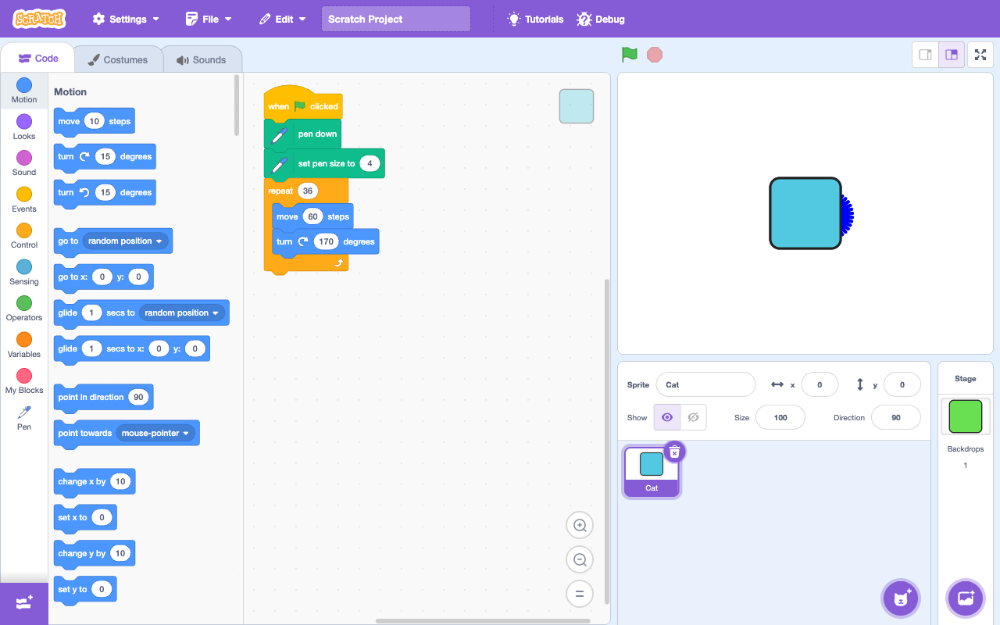

# scratch-mcp

**An MCP server that lets an AI agent build and run real [Scratch](https://scratch.mit.edu) projects.** The agent writes a project as readable text, the server compiles it to a runnable Scratch 3 `.sb3`, loads it into a **live self-hosted Scratch editor**, runs it, and reads the result back — an Xcode-style *edit → reload → run → snapshot* loop over a real project, not a one-shot generation.



*Above: the `repeat (36) [ move (60) steps · turn ↻ (170) degrees ]` pen program below was written as plain text, compiled to `.sb3`, and run in the live editor by tool calls — those are real, correctly-assembled Scratch blocks.*

## The tools

The MCP server is deliberately **thin**: the agent edits the project's source text with its own file tools, and the server handles *build + live editor + inspection*. Ten stdio tools:

| Tool | What it does |
|------|--------------|
| `new_project` | Scaffold a project folder that compiles clean |
| `open_project` | Set the active project for subsequent calls |
| `list_projects` | List projects under the projects root |
| `compile` | Compile source → `.sb3`; returns fail-loud diagnostics (no editor needed) |
| `reload` | Compile **and** load into the live editor — loads *nothing* if compilation fails |
| `run` | Green-flag the project and await a real run-completion signal (with a timeout) |
| `stop` | Stop all running scripts |
| `snapshot` | Screenshot the stage as a PNG image |
| `read_state` | Variables, lists, and per-sprite state — namespaced (no global/local collisions) |
| `import_sb3` | Load an existing `.sb3` to run / inspect (load-only) |

## The loop

The agent edits **plain text** — a `project.yaml` manifest plus one `*.sprite.scratch` file per sprite, in [scratchblocks](https://en.scratch-wiki.info/wiki/Block_Plugin/Syntax) syntax — then calls `reload` → `run` → `snapshot` and sees what happened:

```
# cat.sprite.scratch
when green flag clicked
set [r v] to ((3) + (4))
if <(1) > (2)> then
  change [b v] by (1)
else
  set [b v] to (9)
end
repeat until <(c) = (5)>
  change [c v] by (1)
end
```

The text is the single source of truth — readable, diffable, and reviewable — exactly like Swift files are canonical and the compiled app is derived. The user watches it all land live in the editor tab.

### Use it

Point an MCP client (Claude Desktop, Claude Code, …) at the built server:

```jsonc
{
  "mcpServers": {
    "scratch": { "command": "node", "args": ["/abs/path/to/scratch-mcp/dist/src/index.js"] }
  }
}
```

The editor launches when you set an active project (`open_project` warms it in the background) and is reused for the session. It runs **headless by default** — Claude observes the running project via `snapshot` and `read_state`, which need no window. Set `SCRATCH_MCP_VISIBLE=1` to watch a live editor window instead (`SCRATCH_MCP_HEADLESS=0` also forces a visible window, for back-compat).

## How it works

Three subsystems, one coherent server:

- **Source** — `*.sprite.scratch` (scratchblocks text) + a `project.yaml` manifest.
  ```yaml
  name: Grammar
  sprites:
    - name: Cat
      source: cat.sprite.scratch
  variables:
    global: { r: 0, b: 0, c: 0 }
  ```
- **Compiler** (`src/compiler/`) — a manifest parser + a hand-rolled scratchblocks parser + a per-category block dictionary (`blocks/categories/*.ts`, guarded by a signature-uniqueness check) + a hand-rolled [JSZip](https://stuk.github.io/jszip/) packager that emits Scratch-3 `.sb3`. Headless verification runs against `scratch-vm@5.0.300`. It's **fail-loud**: any unsupported block, unresolved name, or malformed script becomes a precise `file:line` diagnostic rather than a silently-broken project.
  ```ts
  import { compileProject } from "./src/compiler/index.js";
  const { ok, sb3, diagnostics } = await compileProject("path/to/project-dir");
  // ok === false + diagnostics (and no sb3) if anything is malformed — collect-all.
  ```
- **Live-editor bridge** (`src/editor/`) — a self-hosted [scratch-gui](https://github.com/scratchfoundation/scratch-gui) Vite app whose live VM is driven through [Playwright](https://playwright.dev) (`launch / loadProject / run / stop / snapshot / readState / close`), never by faking UI drags. That keeps it robust — the fragile drag-and-drop path is explicitly avoided.

- **MCP layer** (`src/mcp/`) — a `Session` (active project + a lazily-launched editor singleton) and ten thin tool handlers that wrap the compiler and bridge, surfacing diagnostics and namespaced state to the calling agent.

## Block palette

The compiler covers the **entire Scratch 3 default palette** — 135 block definitions across all 11 categories (Motion · Looks · Sound · Events · Control · Sensing · Operators · Variables · Lists · Pen · Music), plus broadcasts and the `extensions[]` (Pen/Music) machinery. Every block is verified under a **dual standard**: a runtime assertion in a headless VM where the effect is observable, or a structural assertion on the emitted `project.json` plus a load-and-run check otherwise — and a coverage test proves every block's signature round-trips to its own opcode.

Out of scope for now: custom blocks/procedures, a real asset resolver (costumes/sounds resolve to a placeholder), on-stage monitors, and a decompiler (`import_sb3` is load-only — turning a `.sb3` back into editable source is a separate forward-vs-reverse problem).

## Develop

Requires **Node ≥ 25**. The compiler/test stack has no native build step.

```bash
npm install
npm run build      # tsc -p tsconfig.json  → dist/
npm test           # vitest run  (compiler + headless-VM + editor + MCP tests)
```

The self-hosted editor (only needed for the live bridge) is built separately under `editor/`.

## Roadmap

- [x] Live-editor bridge (self-hosted scratch-gui, VM-driven via Playwright)
- [x] Compiler pipeline (text → `.sb3`, headless-VM proven, fail-loud)
- [x] Infrastructure extensions (broadcasts, lists, Pen/Music `extensions[]`)
- [x] Full core block-palette dictionary (135 blocks, dual-standard tested)
- [x] **MCP server** — 10 stdio tools wrapping the compiler + bridge; real run-completion signal + per-sprite namespaced state
- [ ] Custom blocks / procedures
- [ ] Asset resolver (real costumes/sounds/backdrops)
- [ ] Decompiler + editable `import_sb3`

## Tech

TypeScript (strict, ESM) · Node ≥ 25 · [`@modelcontextprotocol/sdk`](https://github.com/modelcontextprotocol/typescript-sdk) · Zod · Vitest · JSZip · js-yaml · Playwright · headless `scratch-vm@5.0.300`.

Design specs and implementation plans live under [`docs/superpowers/`](docs/superpowers/).

---

Bundles and drives the MIT/BSD-licensed Scratch runtime and editor ([scratch-vm](https://github.com/scratchfoundation/scratch-vm), [scratch-gui](https://github.com/scratchfoundation/scratch-gui)) by the Scratch Foundation. Not affiliated with or endorsed by the Scratch Foundation.
